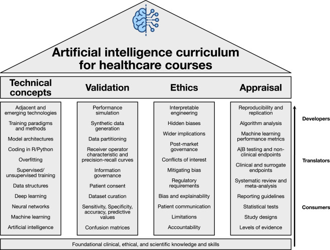

# AI and consumers, translators, and developers

[@Ng2023-tx]

## Consumer

- Consumers require sufficient knowledge and skills to select and use AI tools effectively in clinical settings
- EBM skills as with conventional interventions and procedures
- basic grounding in the principles and process of machine learning will enable consumers to develop an understanding of where pitfalls in an AI system may lie

[@Ng2023-tx]

## Translator

- a bridge between developers, who often have no clinical expertise, and consumers with a limited understanding of AI
- a more in-depth understanding of data structures and AI schemata such as deep learning
- how structured and unstructured data can be leveraged with machine learning and how neural networks develop optimal representation of data through deep learning
- differentiate between supervised and unsupervised training using labeled and unlabeled data, respectively, and define and apply different machine learning tasks: regression, classification, clustering, anomaly detection, etc
- develop basic coding skills in R or Python or use automated machine learning (autoML) for hands-on experience to develop a practical understanding of the capabilities and limitations of ML

- translators should have a strong understanding of study design, statistical analysis, and risk of bias

[@Ng2023-tx]

## Developer

- more extensive computer science knowledge and skills, which supplements their clinical and scientific background
- ability to code in Python or other languages enables them to drive primary AI research from an earlier stage than clinical implementation
- comprise the vanguard of AI development and must be trained to take on this role with appropriate responsibility

[@Ng2023-tx]
