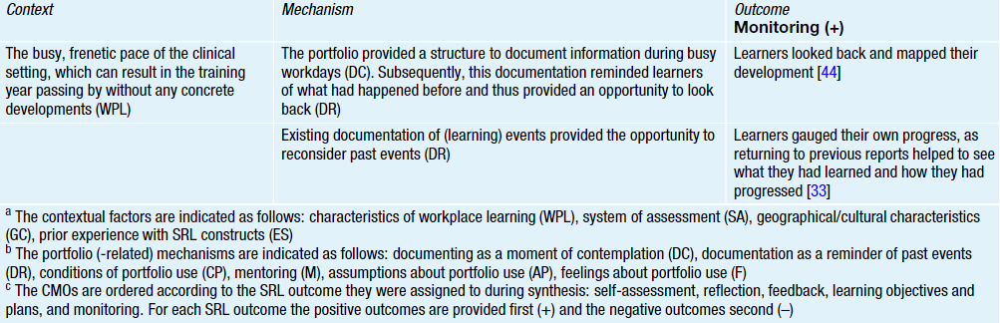

[TOC]

# E-portfolio

## What

## Why

- increased need for reflective practice and the movement toward competency-based medical  education [@Lee2016-lx]
- Proper monitoring and analysis of electronic logbooks can modify teaching and learning activities during the clerkship as well as provide guidance for future modifications of the curriculum [@Cevik2018-rr]

## Barrier

- not tailored to the characteristics (i.e., tasks and context) of the workplace [@Van_der_Schaaf2017-xj]
  - Adopting technology uncritically carries risks [@Fuller2022-zf]
- Burden
  - Filling out e-portfolio is a burden v[@Findyartini2021-up; @Van_Der_Vleuten2015-vy]

- Learners
  - Lack of time
  - Lack of motivation
[@Van_der_Gulden2022-jc]

## Data flow in E-portfolio

E-portfolio is expected to have the following features:

1. the ability to collect feedback and learning results
2. integrate data from multiple platforms
3. visualize the integrated data to help the stakeholder get the holistic view from the integrated data

[@Van_Der_Vleuten2015-vy]

## Impact

### Self-regulated learning in clinical workplace learning

- context–mechanism–outcome configurations (CMOs)
- Mechanisms
  - documenting as a moment of contemplation
    - learners analyze experiences while writing portfolio reports
  - documentation as a reminder of past events
    - previous portfolio reports aid recall
- Limited
  - formulation of learning objectives
  - plans
  - monitoring
- Inhibitating factors
  - contextual factors (e.g., system of assessment)
  - portfolio-related mechanisms (e.g., mentoring)

@import "./E-portfolio/CMO1.csv"

[@Van_der_Gulden2022-jc]

## Examples

### Emergency medicine clerkship

- Purpose
  - improve curriculum teaching and learning opportunities
- Research Question
  - Prospectively analyze student
ED exposures and involvement levels
- prospective study
- all 76 final year medical students
- electronic logbooks (e-Portfolio)
- conclusion
  - useful tool in defining the learning activities

[@Cevik2018-rr]

### Clinical Clerkship in Korea

Comprehensive review and study about e-portfolio.

In summary:

In clinical clerkships, where medical students learn through experience, e-portfolios offer the advantage of enabling real-time recording and assessment of performance. However, challenges have been noted due to the busy nature of clinical settings. These include the limited time available for medical students and supervisors to enter records and feedback, as well as constraints related to network availability and physical location in clinical environments, which can restrict opportunities for input. In addition, the lack of a standardized assessment system and the need for training in the use of e-portfolios have been identified as barriers to their effective use. In order to overcome these challenges, it is necessary to develop a system that can be used in a variety of clinical settings, and to provide training in the use of e-portfolios for both students and supervisors. In addition, it is necessary to develop a standardized assessment system that can be used to evaluate the performance of medical students in clinical settings.

[@Lee2016-lx]

- Purpose
  - identify positive and negative experiences of students and faculty
  - propose recommendations for successful design and implementation of clerkship e-portfolio
- 4 major stakeholder
  - students
  - instructors
  - institutions
  - employers
- Benefit of e-portfolio
  - unlimited space
  - convenient re-processing
  - portability
  - development of technology skills
  - learner-centered environment
  - accessibility
- Negative Exprerience
  - large quantity of work
    - for students
      - Insufficient number of noticeable events
    - for professors
      - Too much assessment work overall
      - Duplicated or repeated works
  - Sutdents' motivation
    - Lack of understanding of purpose and value
    - Lack of feedback
  - Faculty's limitation
    - time constraints
    - prefer oral or written feedback
    - Lack of training
    - Lack of consensus on assessment criteria
    - Lack of technical support
  - Limitation in clinical environment
    - Lack of wireless internet network
    - Difficult use tablet computers
      - lack of portability
    - Lack of time
  - technological difficulties
    - in senior faculty
- Participants
  - 108 third-year medical school students
  - 255 clerkship professors

[@Lee2016-lx]

## Feedback in e-portfolio

[@Fu2019-vb]

## Student model

- Probabilistic representation of a learner’s state and educational context
- a statistical model
  - translates the existing E-portfolio performance scores into the progress state of the learner

[@Van_der_Schaaf2017-xj]

### Types of student model

- Overlay model
  - proper subset of the knowledge of the entire domain
- Differential model
  - the domain knowledge is decomposed into necessary and unnecessary (or optional)
- Perturbation model
  - student ’s knowledge is dichotomized into“correct” and “incorrect”.
- Constraint-based model
  - s the domain knowledge is represented by a set of constraints over the problem state

[@Millan2010-gh]

## References

