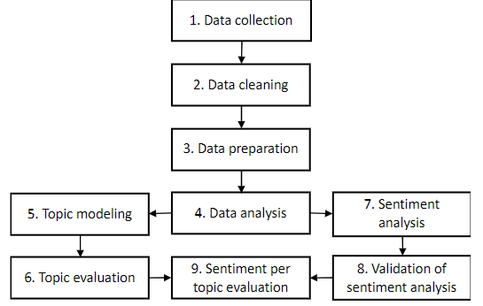
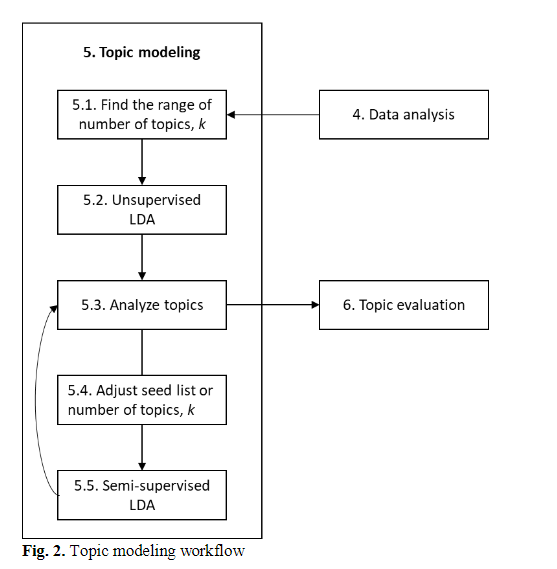

# Interpretation of narrative feedback

## Why interpret narrative feedback automatically?

- interpretation of aggregated, longitudinal narrative feedback
  - proven to be very challenging
  - cognitively demanding
  - time consuming

[@Moonen-van_Loon2022-dn]

- assessment practices witnessed a change
  - from an almost exclusive focus on quantitative assessment data
    - like grades or scores
  - towards provision of rich, narrative and personalized feedback

[@Nicol2006-gn]

## Workflow for interpretation of narrative feedback

[@Nicol2006-gn]

## References
