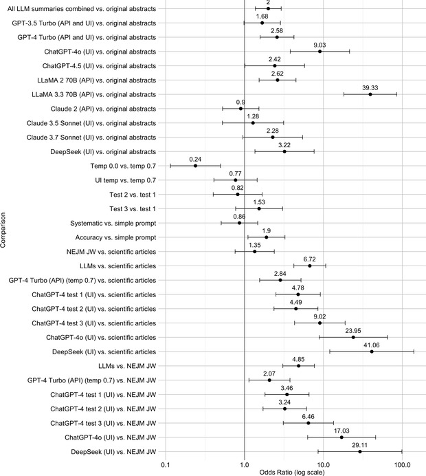

# LLM Accuracy in making Abstracts of Research Papers

## Examined LLMs

* GPT-3.5 Turbo（API or UI）
* GPT-4 Turbo（API or UI）
* LLaMA 2 70B（API）
* Claude 2（API）
* ChatGPT-4o（UI）
* ChatGPT-4.5（UI）
* LLaMA 3.3 70B Versatile（API）
* Claude 3.5 Sonnet（UI）
* Claude 3.7 Sonnet（UI）
* DeepSeek（UI）

## Target Papers

The authors constructed a corpus of 300 scientific texts in two parts:

1. **Abstracts**: 200 research abstracts—100 drawn from the top four general medical journals (Lancet, NEJM, JAMA, BMJ) and 100 from the top four multidisciplinary science journals (Nature; Science; Nature Human Behavior; Psychological Science in the Public Interest)—by collecting the 25 most recent research abstracts from each journal moving backward from December 2023 (excluding non-research content).
2. **Full-length articles**: 100 original prospective clinical study articles (25 per medical journal), sampled by moving backward from May 2023, with corresponding NEJM Journal Watch summaries for comparison.&#x20;

## Methodology

The authors used a systematic three-step framework to assign and compare scores:

1. **Classification & OAO score**
   They first coded each summary (and its source text) for three types of generalizations—generic language, tense shifts (past ⇄ present), and action-guiding vs. descriptive claims—and computed an **Overall Algorithmic Overgeneralization (OAO) score**, i.e. the proportion of summaries containing at least one overgeneralization .

2. **Statistical comparison via GLMM**
   They then compared OAO rates across models, prompts, temperatures, and test iterations using generalized linear mixed models (GLMM), reporting **odds ratios (ORs)** for the likelihood of producing a generalized (vs. restricted) conclusion, with 95 % confidence intervals and p-values, while controlling for key covariates .

## Results

[@Peters2025-uk]