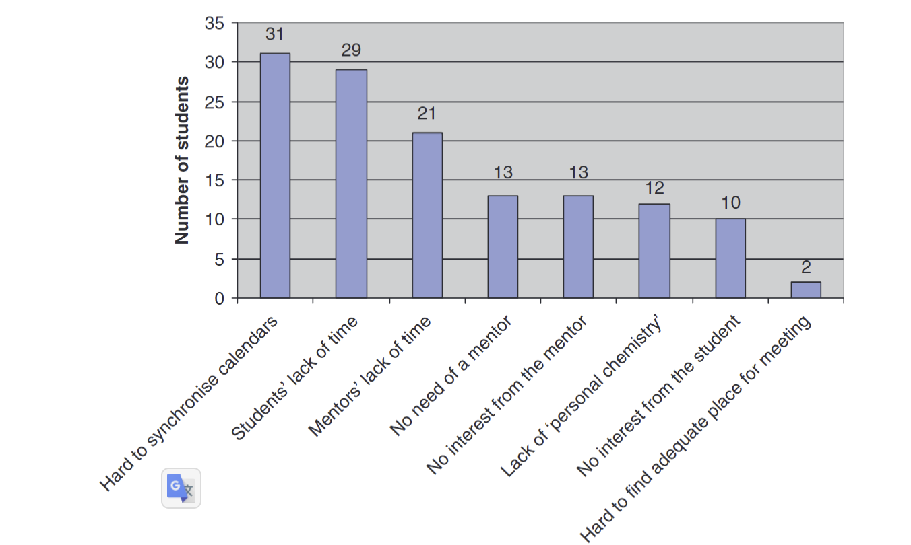

mentoring-networkについて(メンター同士の繋がり)

# Mentoring

## What is mentoring?

- a partnership in personal and professional growth and development [@Sambunjak2006-hr]

## Pourpose

- introduction to everyday student life [@Buddeberg-Fischer2006-kv]
- career development [@Buddeberg-Fischer2006-kv]
- recruit [@Buddeberg-Fischer2006-kv]
- repare students from ethnic minoritie [@Buddeberg-Fischer2006-kv]
- earning their specialist qualificatio [@Buddeberg-Fischer2006-kv]
- develop academic career [@Buddeberg-Fischer2006-kv]

## Form

- formal mentoring
- speed mentoring [@Ramani2020-gv]
  - provides mentees with opportunities to meet multiple mentors over a short time and pose focussed career development questions
- one-to-one mentoring [@Kalen2010-da]
- peer mentoring [@Kalen2010-da]
- group mentoring [@Kalen2010-da]

## Archetypes

1. The Traditional Mentor
   - formal, dynamic and reciprocal relationship in a work environment between themselves and a mentee aimed at promoting the career growth of both
   - frequent hour-long meetings
   - a professional parenting bond
2. The Coach
   - less time with mentees
   - a focused question or set of questions are critical for success
   - transient during a mentee’s career
3. The Sponsor
   - use their influence in a field to make men- tees more visible
   - they rarely directly benefit from a mentee’s success
4. The Connector
   - multipliers that link us up with the world.

[@Chopra2018-if]

## Other professional relationship roles and mentoring

| **Role**      | **Description**                                                                                                                                                                                                 |
|---------------|-----------------------------------------------------------------------------------------------------------------------------------------------------------------------------------------------------------------|
| **Mentor**    | - May be formal or informal - Mentor is often chosen for having more knowledge or experience in a given domain than the mentee, and often a role model - May offer advice and guidance, or share their own experiences, or help the mentee reflect on their experiences - May ask open-ended, closed or leading questions as part of dialogue. Often gives advice. - The primary goal of the relationship is to further the goals of the mentee, but often significant benefits are available for the mentor in terms of their own development - May help deal with past, present or future situations - Psychological safety is a core element in the relationship - Likely a long-term relationship (years) |
| **Coach**     | - Generally a formal role - Often a professional paid-for service, by someone with specific training in coaching, sought by the person being coached - Looks at the present to help guide future performance - Asks open-ended, not leading questions - Coach does not give advice but asks questions that challenge assumptions and prompt reflection - Can be someone entirely outside of the industry/area of expertise of the person being coached. Benefit does not stem from being a role model. - Psychological safety is a core element in the relationship                                                                                                              |
| **Sponsor**   | - Usually an informal role where the sponsor acts as an advocate for their protégé (a junior worker who the sponsor sees as having lots of potential) - Sponsor has a position of authority or influence in an organization or field - Sponsor can create opportunities that the protégé may not be able to access on their own - Relationship may be transactional - if the protégé fails to “deliver”, it may reflect poorly on the sponsor                                |
| **Advisor**   | - Usually a formal role - The advisor should have more knowledge or experience in a given domain than the advisee - Primarily offers advice and guidance                                                                                     |
| **Counsellor**| - Usually formal role - reactionary intervention to support an individual in managing a current problem or a past experience - May ask leading questions and open-ended questions - Non-judgmental, may give advice                                                           |
| **Supervisor**| - A formal role - Has a position of authority over the person being supervised - Relationship is characterized by being accountable to the supervisor who has some role in assessing the performance of the person being supervised - Often a direct educational role in supervision, whether clinical or non-clinical - Need for accountability may take priority over psychological safety - There may be a conflict between the need for openness and honesty about the struggles an individual may be experiencing and the need to pass training or performance targets        |

[@Akrimi_undated-ag]

## Content in mentoring

[@Kalen2010-da]

## Effect

- develop professional attributes
- facilitate socialization into a profession

[@Kalen2010-da]

### in academic medicine

- women had difficulty finding mentors than men

from systematic review by @Sambunjak2006-hr

## Barriers

- timing logistics
- personal chemistry

[@Kalen2010-da]

## Mentoring and Portfolio education

- Mentoring is a key component of portfolio education [@Driessen2007-zd]
- Portfolio education is difficult to succeed without activities like mentoring or group learning [@Driessen2007-zd]

他文献
https://chatgpt.com/share/e/186bb784-8c04-479f-aabf-f709ca978353