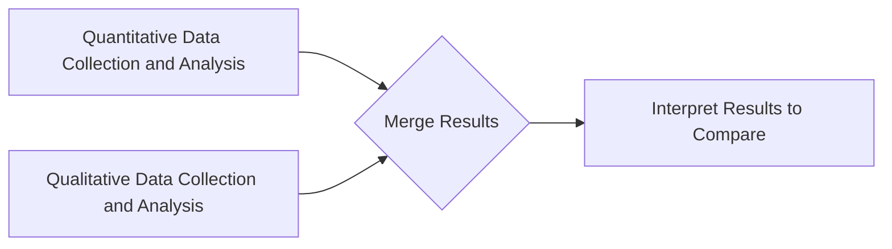
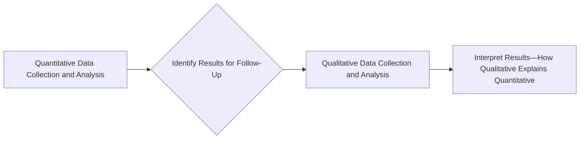

# Mixed methods approach

## What?

- is not just a matter of using different methods together
- might mix
  - measure  concepts  in  different  ways
  - measure different constructs
  - use multiple data collection methods
  - use multiple interconnected  studies
  - synthesize  multiple  studies
  - construct  multivariate  causal  models
  - competitively test rival models and hypotheses
  - engage multiple stakeholders
  - employ multiple theoretical  and  value  frameworks
  - use  multiple  analytical  techniques  and  analysts
  - pursue multiple different questions and issues

[@Ellaway2020-tz]

### Designs and frameworks

- Three basic designs
  - Convergent
    - concurrent
  - Explanatory sequential
    - quant -> qual
  - Exploratory sequential
    - qual -> quant
- Four advanced frameworks
  - multistage
  - intervention
  - case study
  - participatory

[@Fetters2013-ob]

[@Creswell2022-qa]

### Mixed Methods Research Designs

#### Convergent Design (One-Phase Design)

[@Creswell2022-qa]

#### Explanatory Sequential Design (Two-Phase Design)

[@Creswell2022-qa]

#### Exploratory Sequential Design (Three-Phase Design)

[@Creswell2022-qa]

### Stance

- a  purist  stance
  - methods  must  share  a  common  mental model to be combinable
- a-paradigmatic stance
  - practical needs are more important  than philosophical inconsistencies
- a substantive theory stance
  - theory is more important  than method
- a complementary strengths stance
  - different paradigms yield important different  perspectives
- a  dialectical  stance
  - juxtapositions  of  methods  afford  new  insights
- an  alternative  paradigms  stance
  - pragmatic,  realist,  and  emancipatory  approaches  to   inquiry

[@Ellaway2020-tz]

### How to mix?

- triangulation
  - results from one method confirm those from another
- complementarity
  - results from  different  methods  add  breadth  and  depth
- development
  - results  from  method  inform  the   use of others
- initiation
  - different methods offer usefully conflicting views
- expansion
  - different methods are used for exploring different constructs or phenomena
  
[@Ellaway2020-tz]

## References
