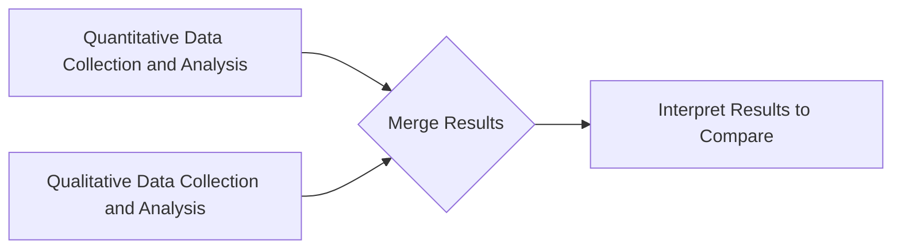
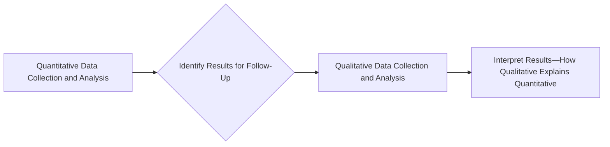

# Mixed methods approach

## What?

- is not just a matter of using different methods together
- might mix
    - measure  concepts  in  different  ways
    - measure different constructs
    - use multiple data collection methods
    - use multiple interconnected  studies
    - synthesize  multiple  studies
    - construct  multivariate  causal  models
    - competitively test rival models and hypotheses
    - engage multiple stakeholders
    - employ multiple theoretical  and  value  frameworks
    - use  multiple  analytical  techniques  and  analysts
    - pursue multiple different questions and issues

[@Ellaway2020-tz]

### Designs and frameworks

- Three basic designs
    - Convergent
        - concurrent
    - Explanatory sequential
        - quant -> qual
    - Exploratory sequential
        - qual -> quant
- Four advanced frameworks
    - multistage
    - intervention
    - case study
    - participatory

[@Fetters2013-ob]

[@Creswell2022-qa]

### Mixed Methods Research Designs

#### Convergent Design (One-Phase Design)

```mermaid
graph LR
    A1[Quantitative Data Collection and Analysis] --> B{Merge Results}
    A2[Qualitative Data Collection and Analysis] --> B
    B --> C[Interpret Results to Compare]
```

[@Creswell2022-qa]

#### Explanatory Sequential Design (Two-Phase Design)

```mermaid
graph LR
    D1[Quantitative Data Collection and Analysis] --> E{Identify Results for Follow-Up}
    E --> F[Qualitative Data Collection and Analysis]
    F --> G[Interpret Results—How Qualitative Explains Quantitative]
```

[@Creswell2022-qa]

#### Exploratory Sequential Design (Three-Phase Design)

```mermaid
graph LR
    H1[Qualitative Data Collection and Analysis] --> I[Identify Feature for Testing]
    I --> J[Quantitatively Test the Feature Designed]
    J --> K[Interpret Results—How Test Improves the Results]
```

[@Creswell2022-qa]

### Stance

- a  purist  stance
    - methods  must  share  a  common  mental model to be combinable
- a-paradigmatic stance
    - practical needs are more important  than philosophical inconsistencies
- a substantive theory stance
    - theory is more important  than method
- a complementary strengths stance
    - different paradigms yield important different  perspectives
- a  dialectical  stance
    - juxtapositions  of  methods  afford  new  insights
- an  alternative  paradigms  stance
    - pragmatic,  realist,  and  emancipatory  approaches  to   inquiry

[@Ellaway2020-tz]

### How to mix?

- triangulation
    - results from one method confirm those from another
- complementarity
    - results from  different  methods  add  breadth  and  depth
- development
    - results  from  method  inform  the   use of others
- initiation
    - different methods offer usefully conflicting views
- expansion
    - different methods are used for exploring different constructs or phenomena
  
[@Ellaway2020-tz]

## Examples

### Convergent design

#### Evaluating the publication practices of medical students

- Quantitative
    - survey
- Qualitative
    - interviews

##### Structure of methods

- survey
- interviews
- reflexivity

[@Onyango2024-cb]

#### Student engagement in medical education

- Quantitative
    - survey
- Qualitative
    - focus group

##### Structure of methods

- setting
- Concept of medical students as module co-directors
- Methodological approach
- Surveys
- Focus group
- Quantitative and qualitative analyses

[@Milles2019-zf]

#### Using entrustable professional activities to determine curriculum and entrustment in anesthesiology

- Quantitative
    - survey
    - Visualized using Stata
- Qualitative
    - survey
    - contentional content analysis

A survey was conducted using SurveyMonkey. The responses were branched, with each branch containing 9-10 questions. The responses included open-ended questions, which were analyzed using conventional content analysis.

##### Structure of methods

- survey
- analysis

[@Burkhart2022-ts]

#### Do we teach critical thinking?

- Qualitative and quantitative
    - faculties' survey
    - students' focus group
- Pragmatism and constructivism
    - good for see justifications and reasons

##### Structure of methods

- methods
- data collection
    - faculty survey
    - student focus group
    - quantitative data analysis
    - Qualitative data analysis
    - Mixed methods analysis

[@Sullivan2024-jc]

#### Ubuntu groups to reduce burnout and social isolation

[@Burt-Miller2024-rb]

#### Faculty perspectives on facilitating medical students' longitudinal learning

##### Study Design

> We used a convergent mixed-methods approach involving an electronic survey of faculty preceptors followed by two semi-structured faculty focus groups.26 Because little is known about faculty strategies and perspectives for facilitating students' longitudinal learning, we chose this design as a means to compare and triangulate data (quantitative and qualitative) to increase the breadth and depth of our findings. We sought quantitative survey data to understand the frequency and range of attitudes and practices in the wider faculty community. Qualitative data from focus groups provided details and context of faculty strategies for teaching (research question 1) and perceived barriers and facilitators (research question 2), which was our primary interest.

##### Data analysis

> For this convergent mixed-methods analyses, we carried out quantitative and qualitative analyses separately first. We then integrated the results over multiple discussions with all authors in which we compared and contrasted the quantitative and qualitative findings.32 We used open-ended survey data to assess whether emergent survey themes contradicted, aligned with, or extended focus group results.

[@Shagrin2022-aj]

#### Medical Students’ Perception and Perceived Value of Peer Learning in Undergraduate Clinical Skill Development and Assessment

- Quantitative
    - performance scores
    - students' perception of peer learning
- Qualitative
    - reflective observational data

[@Alzaabi2021-rm]

## References

::: {#refs}
:::
