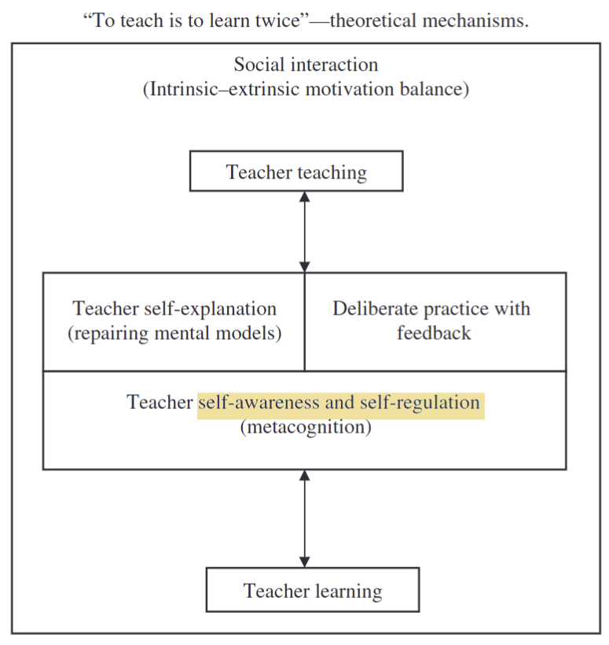

# Near peer teaching

## What is near peer teaching?

- a trainee one or more years senior to another trainee on the same level of medical education training teaching a junior trainee

[@Nelson2013-to]

## Effect

- Faculties
  - Alleviate teaching pressure [@Ten_Cate2007-yo]
- Near-peer tutee
  - Tutors relate well  to junior peers [@Khaw2016-fb]
  - appropriate  level  of  difficulty [@de-Menezes2016-dd]
- Near-peer tutor
  - learning through teaching [@de-Menezes2016-dd]

## Informal near peer teaching

- formal near peer teaching
  - involve faculty input
  - incorporated into medical  curricula
- informal near peer teaching
  - mostly about teaching in classroom or small group settings
  
[@Jones2020-ev]

[@Bowyer2021-ad]

## Learning through teaching

Near peer teachers are...

- Acquiring practical skills and knowledge about teaching and learning that can be applied in their teaching roles.  - Applying  the  evidence  and  principles  that  underlie effective approaches to teaching and learning.
- Reflecting on their educational role during residency as well as with a view to the role of education in their future careers.
- Acquisition of leadership skills essential for those interested in future educational leadership roles.

[@Ramani2016-zn]

### To teach is to learn, theretical model

[@Dandavino2007-rl]

### Examples

#### Near peer PBL tutor also learn CanMEDS roles

[@Homberg2019-wp]

#### GP registrars teaching medical students in small groups

- near-peer teachers are
  - advancing  their  clinical  knowledge
  - negotiating  competing  demands
  - to teac h something  well is to understand it well

[@Jones2020-ev]

#### Near-peer bedside teaching

- Near-peer teacher: interns
  - provide structured bedside clinical teaching
- Near-peer leander: final-year medical students
- Near-peer teachers
  - involvement in the programme made them better clinicians and  helped them to develop as teachers
  - although a neutral response was given to any improvement in knowledge

[@Woods2014-qo]