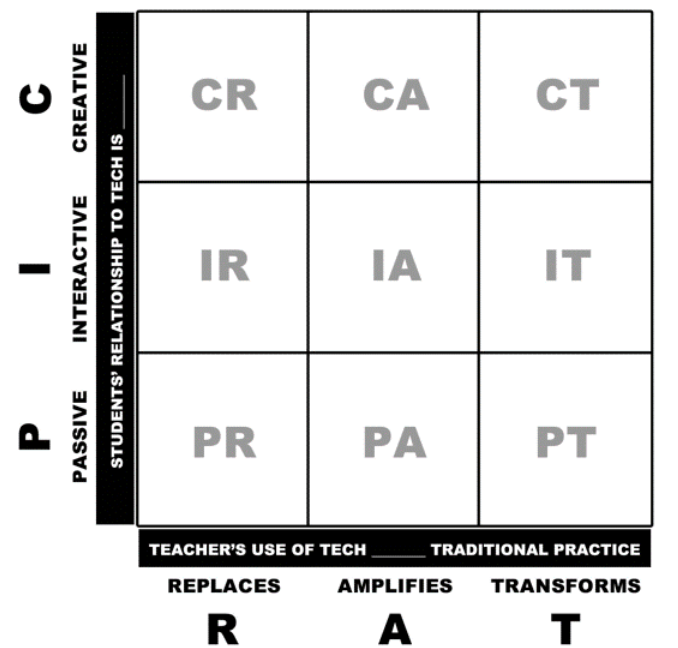

# PICRAT

## What is PICRAT?

- a  theoretical  model  to  guide  teacher  technology  integration [@Kimmons2020-ub]

### Y-axis: PIC: Passive, Interactive, Creative

- Passive:  technology  is  used  to  deliver  content  to  students
- Interactive:  technology  is  used  to  facilitate  interaction  between  students  and  content
- Creative:  technology  is  used  to  facilitate  the  creation  of  new  content  by  students

[@Kimmons2020-ub]

[@Kimmons2020-ub]