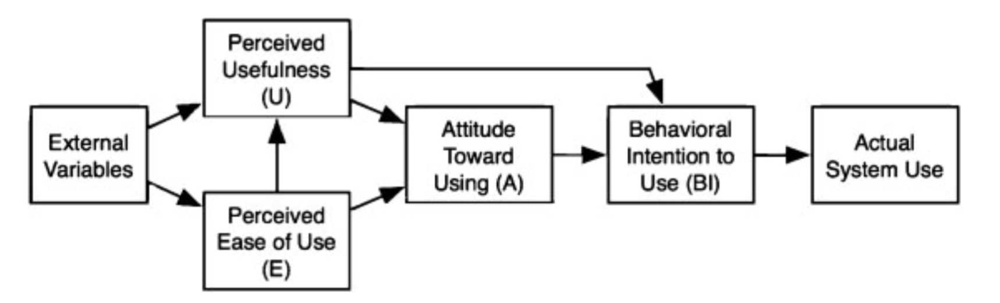

# Technology Acceptance Model

## What?

- a framework to understand the adoption of technologies
- original TAM model, focusing on those two factors as predictors of technology use:
  - perceived usefulness (PU)
  - perceived ease of use (PEOU)
- extended
  - intagrating other theories
    - Theory of Planned Behavior
    - the Unified Theory of Acceptance and Use of Technology
  - context-specific variables
    - subjective norm
    - self-efficacy
    - compatibility
    - experience
    - training
    - anxiety
    - habit
    - facilitators

@Rahimi2018-gk

### Basic image of TAM

@Rahimi2018-gk

## Scale

Developed by @Davis1989-cj

- Perceived Usefulness
  - [ ] Using CHART-MASTER in my job would enable me to accomplish tasks more quickly.
  - [ ] Using CHART-MASTER would improve my job performance.
  - [ ] Using CHART-MASTER in my job would increase my productivity.
  - [ ] Using CHART-MASTER would enhance my effectiveness on the job.
  - [ ] Using CHART-MASTER would make it easier to do my job.
  - [ ] I would find CHART-MASTER useful in my job.
- Perceived Ease of Use
  - [ ] Learning to operate CHART-MASTER would be easy for me.
  - [ ] I would find it easy to get CHART-MASTER to do what I want it to do.
  - [ ] My interaction with CHART-MASTER would be clear and understandable.
  - [ ] I would find CHART-MASTER flexible to interact with.
  - [ ] It would be easy for me to become skillful at using CHART-MASTER.
  - [ ] I would find CHART-MASTER easy to use.

[@Davis1989-cj]

## Examples of use

### WeChat

- Explore acceptance of WeChat for language learning

#### Arranged original TAM

- Continuance intention (adapted from @Zhao2016-jy)
  1. In the near future, I intend to continue using WeChat to learn a language.
  2. My intention is to continue using WeChat to learn a language rather than an alternative application.
  3. I intend to continue using WeChat to learn a language.
- Perceived Usefulness (adapted from @Zhao2016-jy)
  1. WeChat enables me to accomplish more learning tasks.
  2. WeChat increases my learning productivity.
  3. Overall, WeChat is useful for learning a language.
- Perceived Ease of Use (adapted from @Zhao2016-jy)
  1. Learning to use WeChat to learn a language is easy.
  2. My interaction with WeChat to learn a language is clear and understandable.
  3. I find WeChat easy to learn a language.
- Perceived enjoyment (adapted from @Lu2009-lf)
  1. Using WeChat gives me pleasure in learning.
  2. Using WeChat is fun in learning.
  3. Using WeChat makes me happy in learning.
- Conformity behavior
  1. Since others use WeChat to learn a language, I also use it.
  2. Since others like WeChat in learning, I also like it.
  3. Since others think WeChat is useful to learning, I also consider it useful.
- Self-esteem
  1. I believe WeChat is beneficial to me in learning.
  2. I feel proud of use of WeChat in learning.
  3. I think WeChat can make me successful in learning.

#### Note. Five-point Likert-type scale:

    1. strongly  disagree
    2. disagree
    3. neutral
    4. agree
    5. strongly agree.

[@Yu2020-pz]

## Relating to other models

- Decomposed  Theory  of  Planned  Behavior
- Unified Theory of Acceptance and Use of Technology
- Extended UTAUT (UTAUT2)

[@Granic2022-lq]

## References
