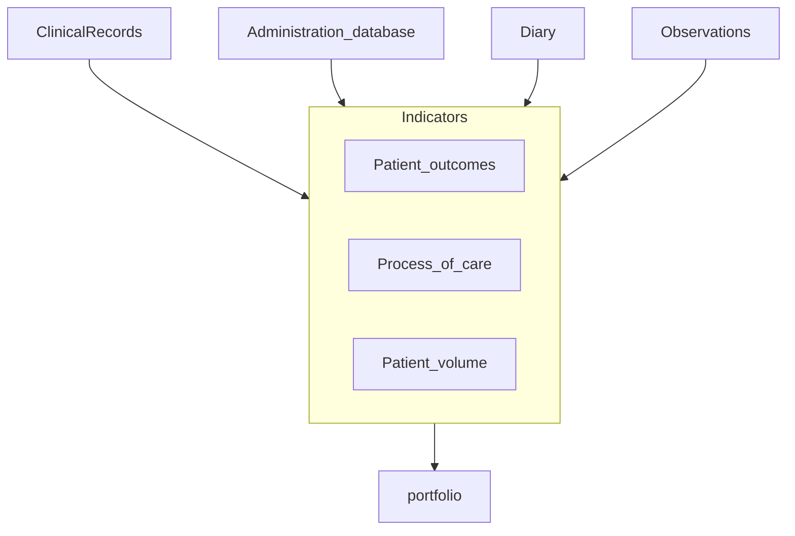

# Work-based assessment

- Focus top level of Miller's pyramid

## Classification of Methods

- clinical records
- administrative data
- diaries
- observation

## Basis for judgment

### Outcomes

- HbA1c, functional status, patients' satisfaction, cost effectiveness
- Problemds to use outcomes
  - attribution
    - systems and teams
  - complexity
    - severity of their illness
    - the existence of comorbid conditions
    - ability to comply with the doctor’s recommendations
  - case mix
    - case mix of different doctors
  - numbers
    - sizeable number of patients are needed

### Process of care

- screening, preventive services, diagnosis, management,prescribing, education of patients, and counselling.
  - HbA1c monitored regularly
  - receive routine foot examinations
- Advantages
  - Arrtibution
    - more directly in the control of the doctor
  - Complexity
    -  measures are less influenced by the complexity of patients’ problems
  - Case mix
    - some of the process measures, such asimmunisation, should be offered to all patients
- Disadvantages
  -  simplydoing the right thing does not ensure the best outcomes forpatients

### Volume

- Judgments about the number of times that doctors have engaged in a particular activity

## Data Collection

- Clinical practice records
  - Major problems
    - judgment only on recorded
    - abstracting records is expensive and timeconsuming
- Administrative databases
  - lack of clinical information
- Diaries
  - diaries or logs to recordthe procedures they perform
- Observation
  - most common forms are...
    - assessment ratings 
      - supervisors
      - peers
      - patients
    - standardised patients

## Portfolios

- may contains...
  - outcomes, process, or volume
  - clinical record audit
  - diaries
  - assessments by patientsand peers

(Norcini, 2003 PMID:12676847)[@PMID12676847]

# Major tools

- mini-CEX
  - assess observed clinical skill performance in authentic clinical situations
  - 6–23 items, depending on specialties
- DOPS
  - assess specific procedural skills
  - 10-18 items
  - subject of the DOPS is different
- MSF
  - external evaluation of the performance over a longer period of time
  - supervisors, peers, non-doctor co-workers, administrative staff, patients, self

(Moonen-van Loon et al., 2013 )[@PMID23494202]

# Validity in work-based assessment

## Three (misleading) assumptions

Neglecting the role of social,cultural and organisational factors in shaping learning and performance development

1. Learning is a deterministic, linear process that can be identifiedand specified in advance
2. Competence, as inferred from performance, is a fixed, permanent and decontextualised attribute
3. Performance can be ‘objectified’ and assessors,if they were only capable to do so, would beable to rate and observe some true level of performance.

- constructivist–interpretivist approaches towards WBA
  -  in order to capture and understand contextualisedlearning and performance in work settings

## Socio-cultural learning theories

Govaerts & van der Vleuten, 2013 PMID:24206150 [@PMID24206150]

# Reliability

## Three major tools

- residents in 12 specialties in Netherland
- September  2008  and  March  2012
- Questions in each tools are connected to CanMEDS competencies

- mini-CEX
  - 6–23 items, depending on specialties
- DOPS
  - 10-18 items
- MSF
  - supervisors, peers, non-doctor co-workers, administrative staff, patients, self

(Moonen-van Loon et al., 2013 )[@PMID23494202]

search... "workplace-based assessment" medical education

# References

- [@PMID23494202]: Composite reliability of a workplace-based assessment toolbox for postgraduate medical education. Advances in Health Sciences Education: Theory and Practice, 18(5), 1087–1102. https://doi.org/10.1007/s10459-013-9450-z PMID:23494202
-  [@PMID12676847]: Work based assessment. BMJ , 326(7392), 753–755. https://doi.org/10.1136/bmj.326.7392.753 PMID:12676847
- [@PMID24206150]: (Govaerts & van der Vleuten, 2013 PMID:24206150)Validity in work-based assessment: expanding our horizons. Medical Education, 47(12), 1164–1174. https://doi.org/10.1111/medu.12289 PMID:24206150