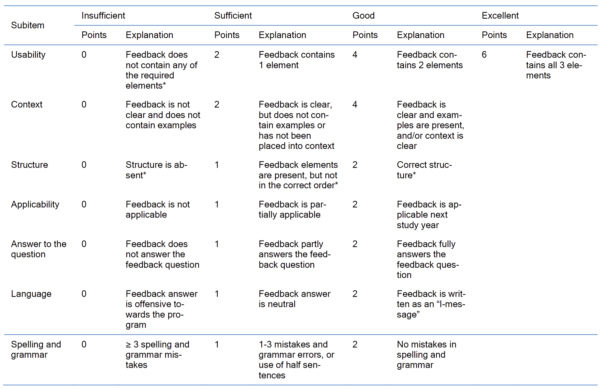
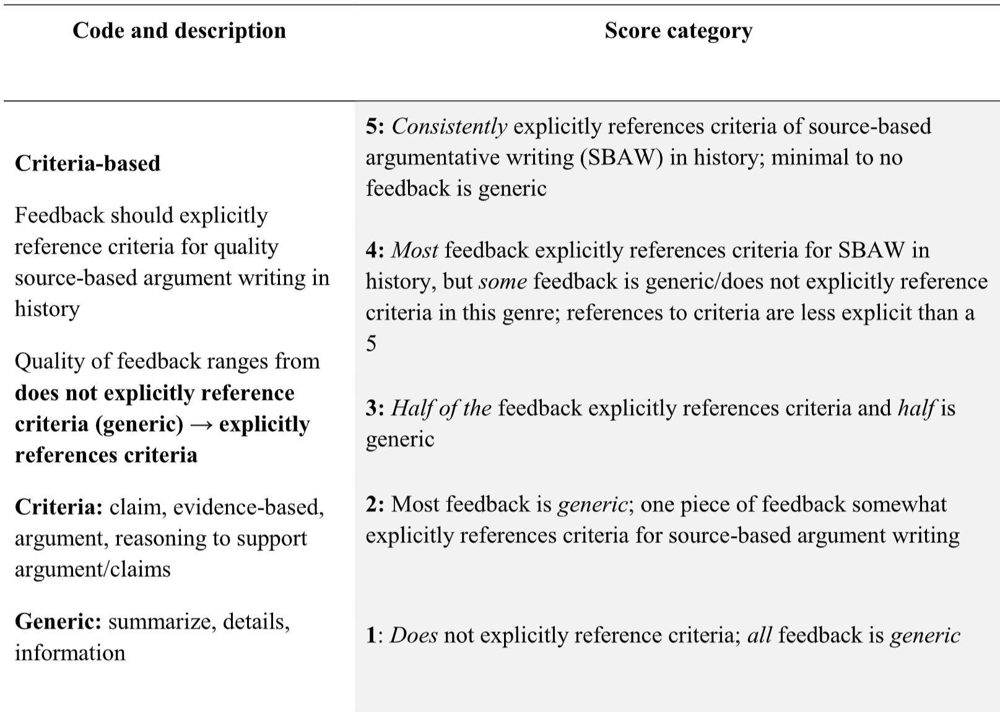
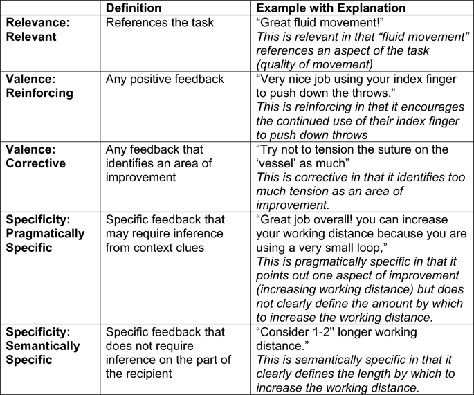

# Feedback Quality Measure

## For feedback comment

### Categorized matrix for feedback comment

- Performance
  - describe the student’s performance on which the feedback is provided
- Judgment
  - include a judgment to denote the gap between this performance and a standard
- Elaboration
  - contain an elaboration statement that builds further on the judgment
- Improvement
  - provide strategies on how the student’s performance can be improved

[@Van_Ostaeyen2023-ut]

| Code | Definition |
| -- | --|
| Performance | The task on which the feedback is provided. This task must be observable. |
| Judgment | An adjective used to denote the gap between the performance and a standard.   It is an evaluative statement expressed as a judgment on past performance. |
| Elaboration | Informative statement that builds further on the judgment expressed as a  question, confirmation,  suggestion, or justification… (e.g. it indicates what went well or did not go well, why it went well or not…). In doing so, it gives more details about the judgment. |
| Improvement | The aim of feedback is to improve the trainee’s performance. The feedback must suggest strategies for improvement. |

[@Van_Ostaeyen2023-ut]

### Rubrics for feedback

#### for narrative feedback in medicine of biomedical sciences student

- Bachelor  of  Science  (undergraduate)  curricula  of  Medicine   and  Biomedical  Sciences
- to assess the quality of narrative feedback for curirriculum by students

- required sample size
  - 80 feedback per group(https://chat.openai.com/share/02b76d68-9f8b-454e-85e4-7be0dbecc7fd)

[@Jacobs2023-hp]

#### to compare human and ChatGPT feedback

- feedback for essay writing in Grades 6-12
  - source-based argument essays in history
- feedback by
  - human teachers(16)(20-25min/essay)
  - ChatGPT(v3.5)
- 200 hundred pieases of feedback
- rubric developed by
  - deductive  framework to  score human- and ChatGPT-generated feedback across the five components  of  quality  formative  feedback

##### Criteria-based

- **Score Category**: Criteria-based feedback should explicitly reference criteria for quality source-based argument writing in history (SBAW).
  - **5**: Consistently explicitly references criteria of SBAW; minimal to no feedback is generic.
  - **4**: Most feedback references criteria; some feedback is generic.
  - **3**: Half of the feedback explicitly references criteria and half is generic.
  - **2**: Most feedback is generic; one piece somewhat references criteria.
  - **1**: Does not explicitly reference criteria; all feedback is generic.

##### Clear directions for improvement

- **Score Category**: Feedback should mark what a writer has done well and be specific about where and how they can improve.
  - **5**: Consistently gives clear directions for improvement; offers specific examples; all feedback is clear.
  - **4**: Mostly offers usable feedback; some is less clear.
  - **3**: Even mix of specific and vague suggestions.
  - **2**: Minimal references to specific student writing or lacks actionable steps.
  - **1**: Does not reference specific student writing and does not give concrete steps aligned with rubric/prompt.

##### Accurate

- **Score Category**: Feedback must be accurate for cognitive and affective reasons.
  - **5**: All feedback is accurate.
  - **4**: Most feedback is accurate; one piece is somewhat inaccurate.
  - **3**: Some feedback is accurate; some clearly inaccurate.
  - **2**: Feedback is mostly inaccurate.
  - **1**: Feedback is inaccurate, irrelevant to student writing.

##### Prioritization of essential features

- **Score Category**: Feedback should respond to appropriate elements of writing and mention the next step in development.
  - **5**: All feedback focuses on the most appropriate priority to work on.
  - **4**: Most feedback is attainable and reasonable; prioritizes one of the most appropriate things.
  - **3**: Even mix of prioritizing essential and nonessential features.
  - **2**: Most feedback is unattainable, nonessential, or inappropriate.
  - **1**: Feedback is too difficult or does not mention any essential features.

##### Supportive tone

- **Score Category**: Quality of feedback ranges from unsupportive and directive to affirming and supportive.
  - **5**: Consistently affirming; uses suggestive and respectful language.
  - **4**: Most feedback uses suggestive/supportive language, some does not.
  - **3**: Even mix of suggestive/directive language.
  - **2**: Most language is directive or lacks any positive affirmation.
  - **1**: No positive comments and no suggestive, respectful language.

[@Steiss2024-ra]

#### in basic surgical skills

##### Schema

- valence
  - positive/reinforcing vs negative/corrective
- specificity
  - specific vs nonspecific
- relevance
  - relevant vs irrelevant

[@Zhou2023-dc]

##### Rubric table

- used to evaluate the feedback in basic surgical skills curriculum

[@Zhou2023-dc]

| | Definition | Example with Explanation |
| -- | -- | -- |
| Relevance: Relevant | References the task | “Great fluid movement!”  This is relevant in that “fluid movement” references an aspect of the task (quality of movement) |
| Valence: Reinforcing | Any positive feedback | “Very nice job using your index finger to push down the throws.”  This is reinforcing in that it encourages the continued use of their index finger to push down throws |
| Valence: Corrective | Any feedback that identifies an area of improvement | “Try not to tension the suture on the ‘vessel’ as much”  This is corrective in that it identifies too much tension as an area of improvement. |
| Specificity: Pragmatically Specific | Specific feedback that may require inference from context clues | “Great job overall! you can increase your working distance because you are using a very small loop,”  This is pragmatically specific in that it points out one aspect of improvement (increasing working distance) but does not clearly define the amount by which to increase the working distance. |
| Specificity: Semantically Specific | Specific feedback that does not require inference on the part of the recipient | “Consider 1-2'' longer working distance.”  This is semantically specific in that it clearly defines the length by which to increase the working distance. |

[@Zhou2023-dc]

## References
