# Feedback

## What?

> Information provided by an agent (e.g., teacher, peer, book, parent, self, experience) regarding aspects of one's performance or understanding

[@Hattie2007-kx]

## Purpose

- To reduce discrepancies between current understandings and performance and a goal

[@Hattie2007-kx]

## Three questions

- Where am I going?
  - What are the goals?
- How am I going?
  - What progress is being made toward the goal?
- Where to next?
  - What activities need to be undertaken to make better progress?

[@Hattie2007-kx]

## Focus of feedback

- Task
  - Feedback about the task itself
- Process
  - Feedback about the processes used to complete the task
- Self-regulation
  - Feedback about the self as a learner
- Self
  - Feedback about the self as a person

[@Hattie2007-kx]

## Influences of feedback

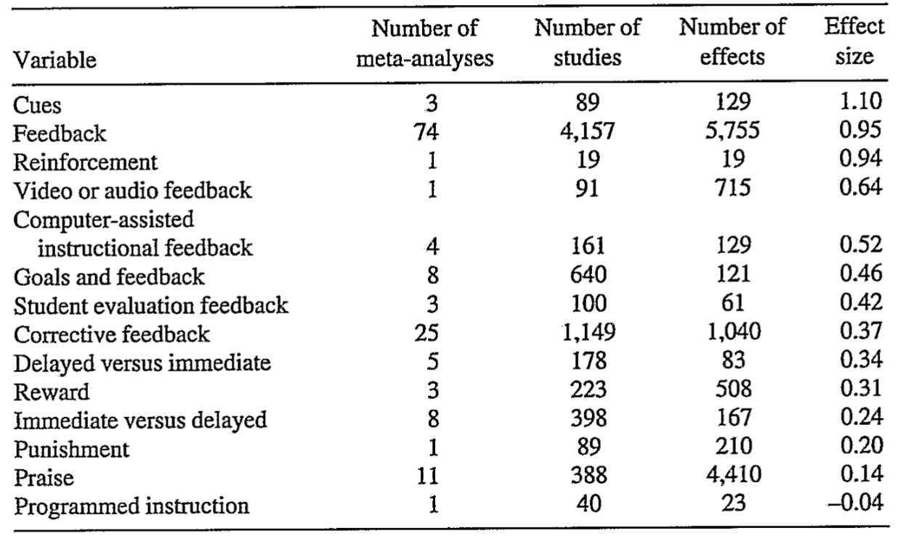

[@Hattie2007-kx]

## Methods

### Peer feedback

- Peer feedback is considered to be successful because the power differentials are minimized [@Hunt2021-ng]

## Models

### Focusing on the way of giving feedback

#### Five step microskills model

1. get a commitment
2. probe for supporting evidence
3. teach general rules
4. reinforce what was done right
5. correct mistakes

[@Neher1992-qr]

### Focusing on the feedback receiver

#### Feedback Literacy

see [Feedback Literacy](Feedback%20Literacy.md)

[@Carless2018-ul]

### Focusing on the process of feedback

#### Three conditions for feedback loop

1. student knowledge of the standards that needs to be applied
2. having to compare those standards to the students’ own work
3. the student taking action to close the gap between the two

[@Boud2012-gs]

#### Feedback Loop

- traditional view of feedback from engineering
  - a process in which information about the past or the present influences the same phenomenon in the present or future
  - a feedback loop is a system structure that causes output from one node to eventually influence input to that same node
- In feedback loops
  - Feedback is information about the gap between the actual level and the reference level of a system parameter which is used to alter the gap in some way  - needs monitoring students’ work to determine if the information provided to them had an effect on what they did
- completion of a feedback  loop is needed to adjust the actions of teachers to ensure an impact on student learning
- Without this information, teachers are blind to the consequences of their actions and cannot therefore act effectively to improve the quality of learning

[@Boud2012-gs]

##### Criticism of feedback loop

- not sustainable
  - too much work for teachers (it is difficult to monitor all students’ work)
  - In the long term, studentswill graduate and the infrastructure of support for learning that this model assumes has to fade and disappear

[@Boud2012-gs]

### Feedback Culture and Growing mindset

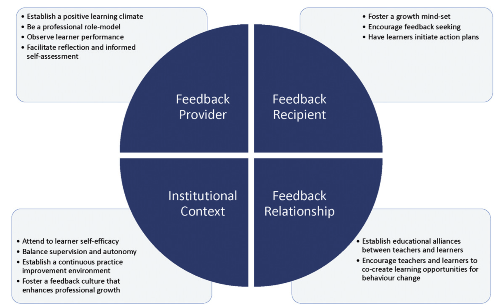

[@Ramani2019-ap]

#### Twelve tips for giving feedback effectively in the clinical environment

1. Establish a positive learning climate and be a professional role-model
2. Use direct observation of performance to generate feedback data
3. Facilitate reflection and informed self-assessment
4. Foster a growth mind-set among learners
5. Encourage feedback seeking behavior
6. Promote learner initiated action plans for behavior change
7. Establish an educational alliance
8. Encourage teachers and learners co-create learning opportunities for behavior change
9. Ensure appropriate attention to learner self-efficacy
10. Promote optimal balance of supervision and autonomy
11. Establish a continuous practice improvement environment
12. Emphasize a feedback culture that enhances professional growth

[@Ramani2019-ap]

## Criteria

### Guidelines: the do’s, don’ts and don’t knows of feedback for clinical education

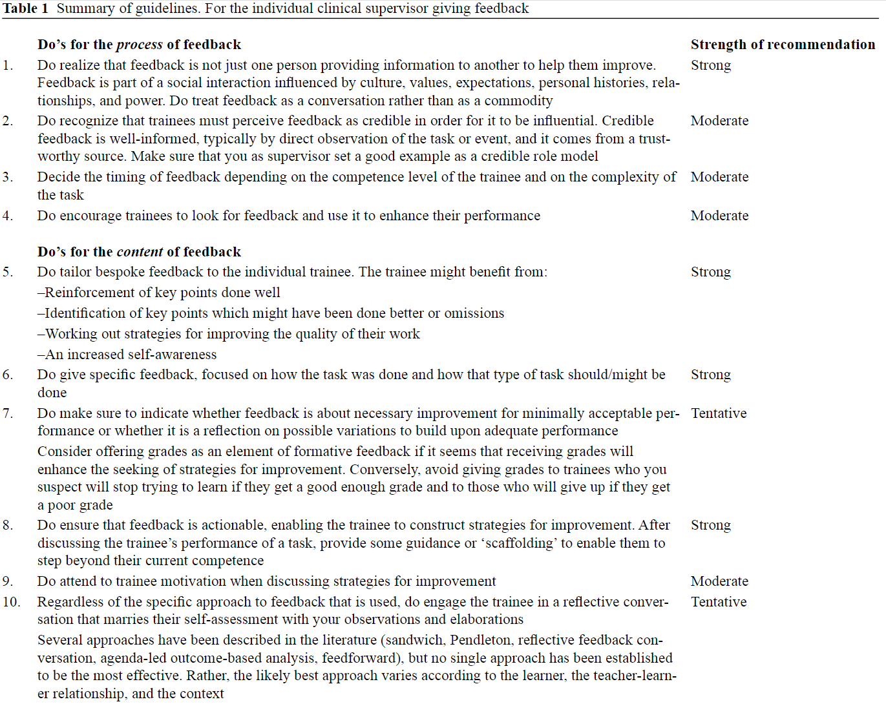
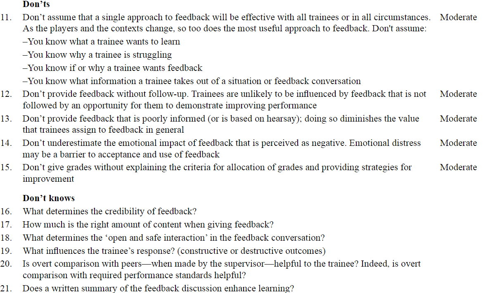
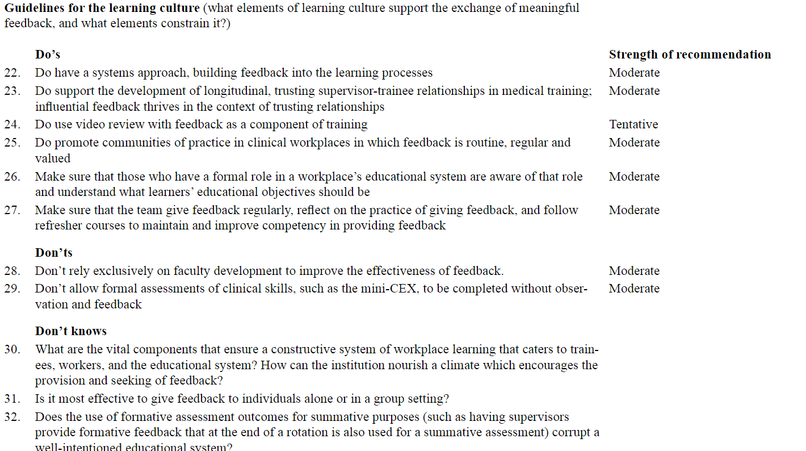

[@Lefroy2015-vv]

### Researches for good feedback

#### Form the perspective of residents

- residents pile-sorted written comment
- interview for residents
- Good
  - specific
  - examples of behaviors and performance
- Bad
  - nonspecific
  - vague
  - generic
- good comments tend to longer than bad comments

[@Gulbas2016-yn]

### Categorized matrix for feedback comment

- Performance
  - describe the student’s performance on which the feedback is provided
- Judgment
  - include a judgment to denote the gap between this performance and a standard
- Elaboration
  - contain an elaboration statement that builds further on the judgment
- Improvement
  - provide strategies on how the student’s performance can be improved

[@Van_Ostaeyen2023-ut]

| Code | Definition |
| -- | --|
| Performance | The task on which the feedback is provided. This task must be observable. |
| Judgment | An adjective used to denote the gap between the performance and a standard.   It is an evaluative statement expressed as a judgment on past performance. |
| Elaboration | Informative statement that builds further on the judgment expressed as a  question, confirmation,  suggestion, or justification… (e.g. it indicates what went well or did not go well, why it went well or not…). In doing so, it gives more details about the judgment. |
| Improvement | The aim of feedback is to improve the trainee’s performance. The feedback must suggest strategies for improvement. |

[@Van_Ostaeyen2023-ut]

### Rubrics for feedback in basic surgical skills

#### Schema

- valence
  - positive/reinforcing vs negative/corrective
- specificity
  - specific vs nonspecific
- relevance
  - relevant vs irrelevant

[@Zhou2023-dc]

#### Rubric table

- used to evaluate the feedback in basic surgical skills curriculum

[@Zhou2023-dc]

| | Definition | Example with Explanation |
| -- | -- | -- |
| Relevance: Relevant | References the task | “Great fluid movement!”  This is relevant in that “fluid movement” references an aspect of the task (quality of movement) |
| Valence: Reinforcing | Any positive feedback | “Very nice job using your index finger to push down the throws.”  This is reinforcing in that it encourages the continued use of their index finger to push down throws |
| Valence: Corrective | Any feedback that identifies an area of improvement | “Try not to tension the suture on the ‘vessel’ as much”  This is corrective in that it identifies too much tension as an area of improvement. |
| Specificity: Pragmatically Specific | Specific feedback that may require inference from context clues | “Great job overall! you can increase your working distance because you are using a very small loop,”  This is pragmatically specific in that it points out one aspect of improvement (increasing working distance) but does not clearly define the amount by which to increase the working distance. |
| Specificity: Semantically Specific | Specific feedback that does not require inference on the part of the recipient | “Consider 1-2'' longer working distance.”  This is semantically specific in that it clearly defines the length by which to increase the working distance. |

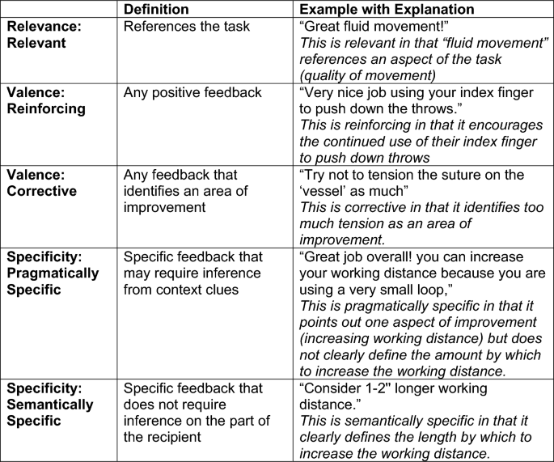

[@Zhou2023-dc]

## Challenges

### in EPA assessment

- feedback seeking was onerous
- quality of feedback was worsened
  - reducing it to a form-filling exercise
  - assessments were felt to have increased daily workload

[@Branfield_Day2020-gi]

### clinical midwifery education

- intensive and integrated feedback were not supported

[@Nugraheny2016-ce]

### on professional behavior (by written feedback)

- directed content analysis of 970 written feedback comments from 197 observers
- most information lacked actionable information

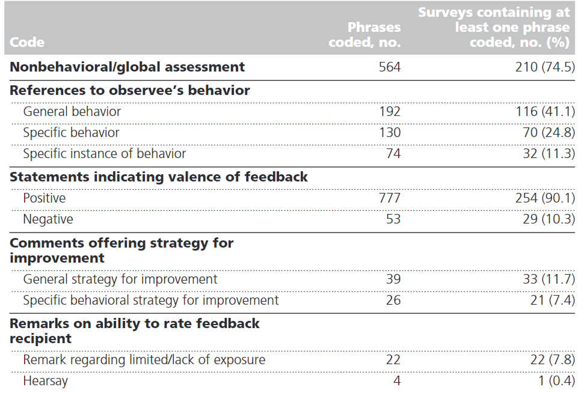

[@Canavan2010-zh]

## Faculty development

- Faculty development is important  but not sufficient
  - FD can tell
    - how feedback is given
  - FD cannot change
    - how feedback received by learner
    - feedback culture
  - also require learners’ receptivity to feedback
  - need to be accompanied by changes in the culture of feedback

[@Lefroy2015-vv]

## Comments to summative assessment

- only few comments can contribute to reliable raking of students

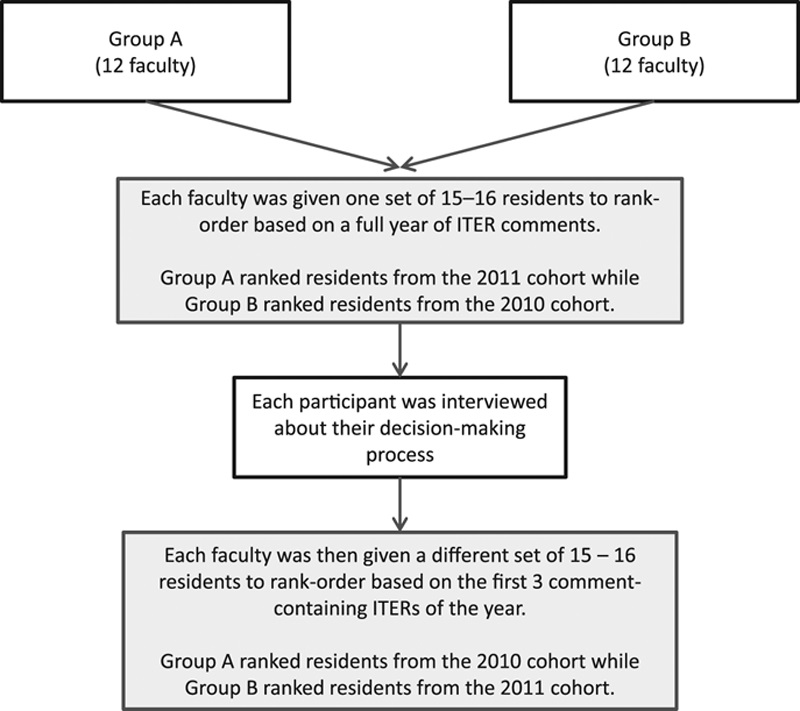
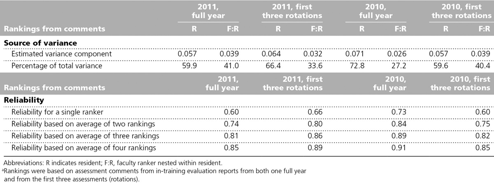

[@Ginsburg2017-ru]

### Read between the lines

- 24 faculty categorized a subgroup of residents based solely on comments for their clinical performance
- They were then interviewed to determine how they had made their judgement
- Residents wer categorized into
  - A = outstanding, excellent, exemplary
  - B = solid,safe, may need some fine tuning
  - C = borderline, bare minimum, remediable
  - D = unsafe, unacceptable, multiple deficits
- Participants made inferences based on what they thought evaluators intended by their comments and seemed to share an understanding of a ‘hidden code’
- Participants’ ability to ‘read between the lines’ explains how comments can be effectively used to categories and rank-order residents.

[@Ginsburg2017-ru]

## Role of technology-enhanced approaches

- Facilitating timely and convenient sharing of comments
- Students generally value
  - personalized and engaging nature of audio feedback
- Recent developments in learning analytics enable
  - information based on learning logs
  - digital traces to provide timely personalized feedback at scale

[@Hattie2007-kx]

### Evaluate Feedback using AI

#### Feedback comment quality and relevance to CanMed roles

- 2,349 written feedback comments from healthcare students’ ePortfolios
  - five healthcare educational programs:
    - specialistic medicine (postgraduate), general practice (postgraduate), midwifery (undergraduate), speech therapy (undergraduate) and occupational therapy (undergraduate).
- Manual labeling by human
  - feedback quality, and CanMed roles
- Fine-tuned BERT using labeled data
- Compare the performance of BERT with human
  - Calculate the F1 score
- Result

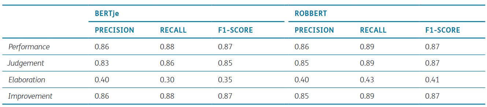

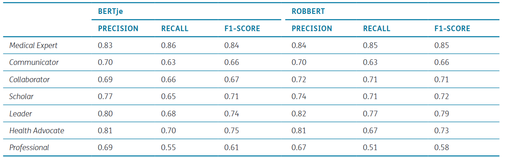

[@Van_Ostaeyen2023-ut]

### Feedback using AI

#### Effectiveness of AI-generated feedback

##### Prompts and feedback quality

- developed a theory-driven prompt manual

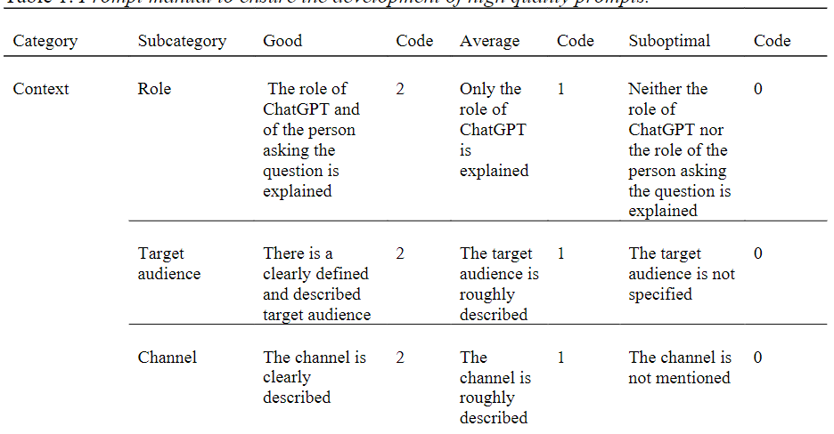
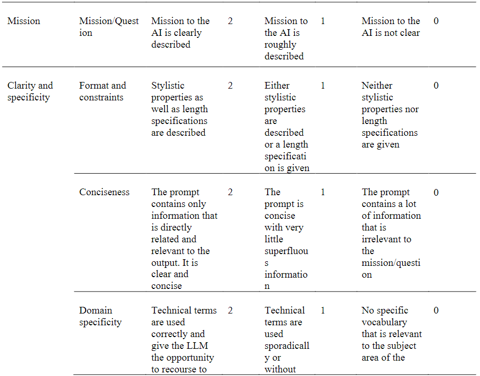
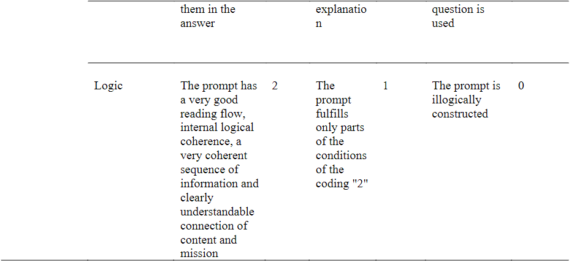

[@Jacobsen2023-jl]

##### In chinese to english translation

- revision of Chinese to English translation based on feedback below
  - AI-generated feedback(ChatGPT4)
  - teacher feedback(TF)
  - self-feedback(SF)
- TF-and SF-guided translation texts surpassed those with ChatGPT-based feedback
  - linguistic features: ChatGPT was superior to TF and SF
  - syntax-related skills: ChatGPT was inferior to TF and SF

[@Cao2023-xn]

##### on secondary student essays

- compared the quality of human  and AI(ChatGPT(v.3.5)) feedback
- five measures
  - (a) was criteria-based, 
  - (b) provided clear directions for improvement
  - (c) was accurate
  - (d) prioritized essential features
  - (e) used a supportive tone
- human raters were better at providing high-quality feedback to students in all categories other than criteria-based

#### LLMs in English writing class

- Writing assignments of English as a second language (ESL) students
- RCT: LLM-generated feedback vs no feedback
- Groups
  - LLM-generated feedback
    - revised their text according to the feedback by ChatGPT3.5-turbo
  - Control group
    - revised their text without feedback
- Result
  - LLM-generated feedback group
    - increased revision performance (d=.19)
    - task motivation (d=.36)
    - positive emotions (d=.34)

[@Meyer2023-sp]

#### Feedback to peer teachers

- participants
  - parciticipants of in-service teacher professional development course
  - 

[@Hunt2021-ng]

#### In programming assignments

- explorer the design of feedback for programming assignments

[@Hao2022-mt]

#### Robotic surgery

- analyzing video recorded robotic colorectal surgery
- compare with the scores by the expert surgeons (using global evaluative assessment of robotic skills (GEARS))
- positive correlation between human expert ratings of technical  efficiency and AI-determined total tool movement (r = − 0.72)

[@Yang2023-uc]

#### second language Writing

- automated written corrective feedback
- Using Notion AI
- an help improve self-regulation
  - through recording the whole writing process
  - AI allows learners to receive immediate, self-tailored, comprehensive AWCF
    - promote language-related noticing

[@Osawa2023-tc]

#### Automated Feedback

### Risks related to technology-enhanced approaches

- the process may still be dominated by feedback as telling
  - may inhibit students responsibility
- not ensue unless there are designs for student uptake
  - learner agency may be lacking

[@Carless2018-ul]

## References
