# Feedback

## What?

> Information provided by an agent (e.g., teacher, peer, book, parent, self, experience) regarding aspects of one's performance or understanding

[@Hattie2007-kx]

## Purpose

- To reduce discrepancies between current understandings and performance and a goal

[@Hattie2007-kx]

## Importance

- key step to acquiring clinical skills [@Ende1983-yv]
- important means for changing behavior [@Norcini2007-dh]
- enriches the learning experience [@Burgess2020-tj]

## Three questions

- Where am I going?
    - What are the goals?
- How am I going?
    - What progress is being made toward the goal?
- Where to next?
    - What activities need to be undertaken to make better progress?

[@Hattie2007-kx]

## Focus of feedback

- Task
    - Feedback about the task itself
- Process
    - Feedback about the processes used to complete the task
- Self-regulation
    - Feedback about the self as a learner
- Self
    - Feedback about the self as a person

[@Hattie2007-kx]

## Influences of feedback

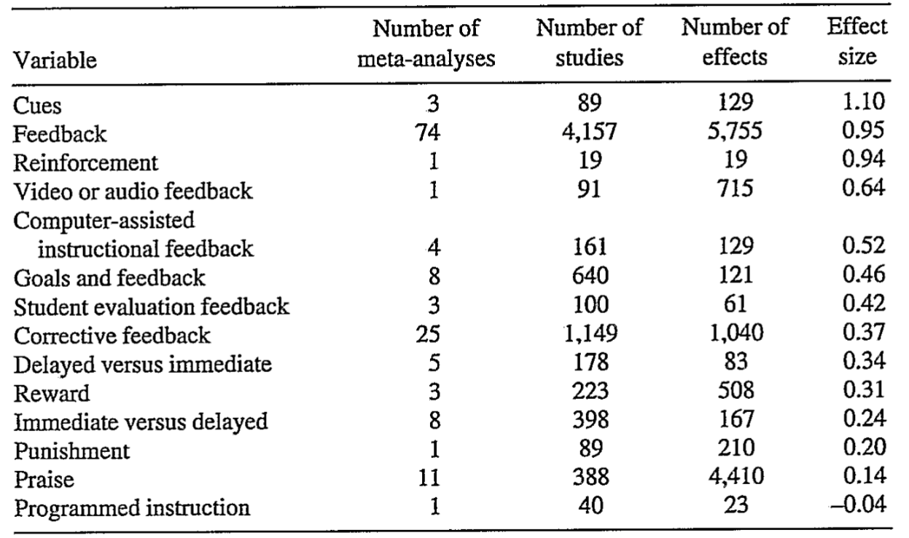

[@Hattie2007-kx]

## Methods

### Peer feedback

- Peer feedback is considered to be successful because the power differentials are minimized [@Hunt2021-ng]

### Written feedback

- Contributes to the continuity of learning (especially when feedback is visualized and shared among multiple instructors) [@Harvey2013-hx]
- Written feedback from patients promotes self-directed learning [@Bjorklund2022-og]
- Interplay with verbal feedback [@Greviana2024-xd]
- Performance assessment [@van-der-Vleuten2018-hd]
- Inform assessment decisions [@Gingerich2024-ck]

## Models

### Composite model: the feedback components

- Elements
    - Educational alliance
    - Observe performance
    - Choose the right time
    - seek learner's self-assessment
    - provide feedback
    - explore learner's view
    - action plan

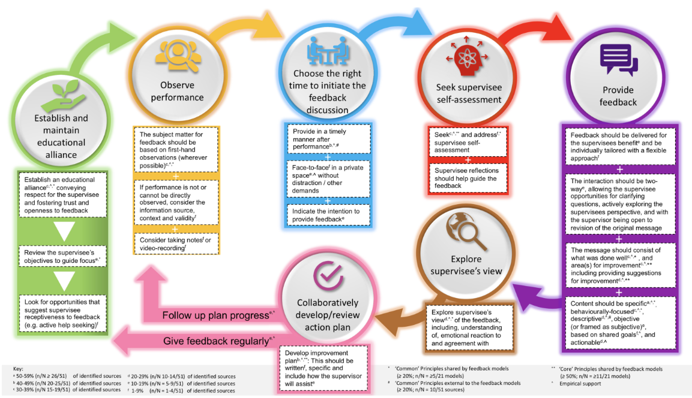

[@Weallans2022-de]

### Focusing on the way of giving feedback

#### Five step microskills model

1. get a commitment
2. probe for supporting evidence
3. teach general rules
4. reinforce what was done right
5. correct mistakes

[@Neher1992-qr]

### Focusing on the feedback receiver

#### Feedback Literacy

see [Feedback Literacy](Feedback%20Literacy.md)

[@Carless2018-ul]

### Focusing on the process of feedback

#### Three conditions for feedback loop

1. student knowledge of the standards that needs to be applied
2. having to compare those standards to the students’ own work
3. the student taking action to close the gap between the two

[@Boud2012-gs]

#### Feedback Loop

- traditional view of feedback from engineering
    - a process in which information about the past or the present influences the same phenomenon in the present or future
    - a feedback loop is a system structure that causes output from one node to eventually influence input to that same node
- In feedback loops
    - Feedback is information about the gap between the actual level and the reference level of a system parameter which is used to alter the gap in some way  - needs monitoring students’ work to determine if the information provided to them had an effect on what they did
- completion of a feedback  loop is needed to adjust the actions of teachers to ensure an impact on student learning
- Without this information, teachers are blind to the consequences of their actions and cannot therefore act effectively to improve the quality of learning

[@Boud2012-gs]

##### Criticism of feedback loop

- not sustainable
    - too much work for teachers (it is difficult to monitor all students’ work)
    - In the long term, students will graduate and the infrastructure of support for learning that this model assumes has to fade and disappear

[@Boud2012-gs]

### Feedback Culture and Growing mindset

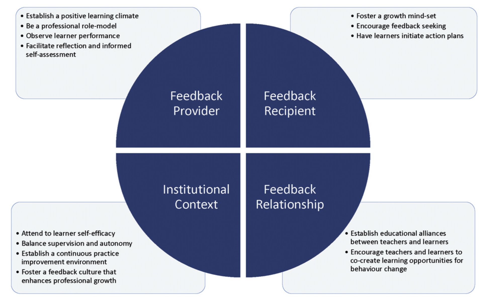

[@Ramani2019-ap]

#### Twelve tips for giving feedback effectively in the clinical environment

1. Establish a positive learning climate and be a professional role-model
2. Use direct observation of performance to generate feedback data
3. Facilitate reflection and informed self-assessment
4. Foster a growth mind-set among learners
5. Encourage feedback seeking behavior
6. Promote learner initiated action plans for behavior change
7. Establish an educational alliance
8. Encourage teachers and learners co-create learning opportunities for behavior change
9. Ensure appropriate attention to learner self-efficacy
10. Promote optimal balance of supervision and autonomy
11. Establish a continuous practice improvement environment
12. Emphasize a feedback culture that enhances professional growth

[@Ramani2019-ap]

## Criteria

### Guidelines: the do’s, don’ts and don’t knows of feedback for clinical education

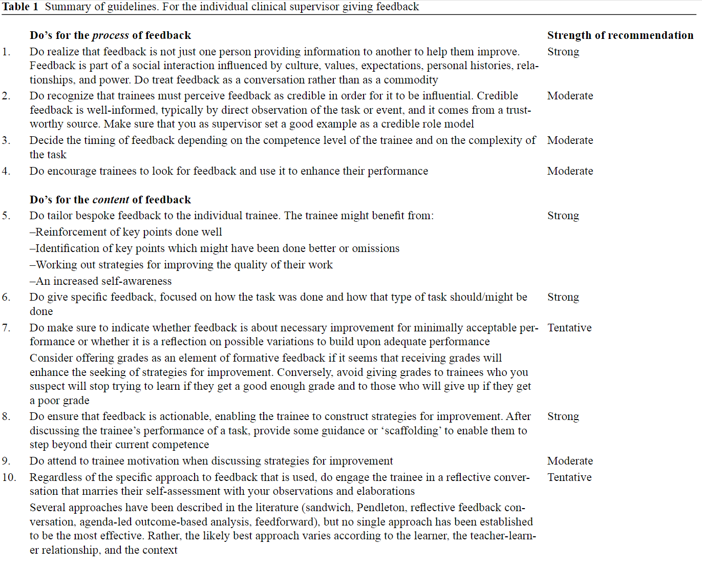
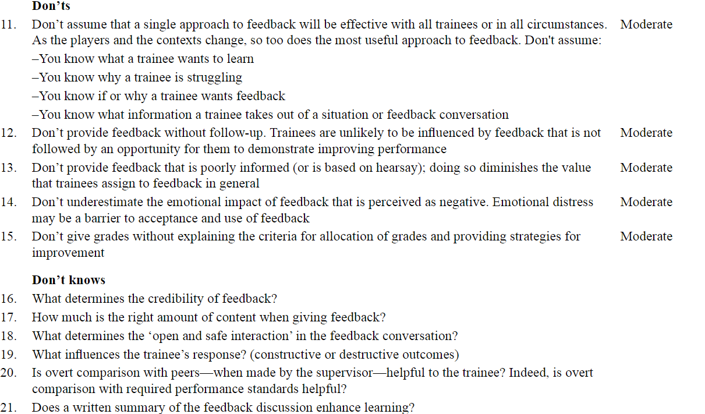
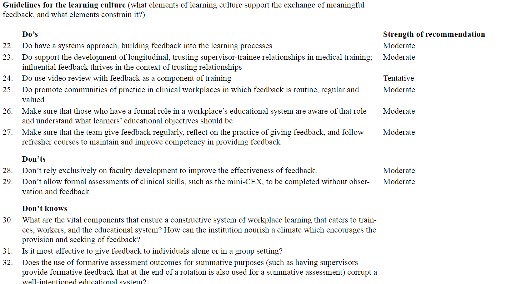

[@Lefroy2015-vv]

### Researches for good feedback

#### Form the perspective of residents

- residents pile-sorted written comment
- interview for residents
- Good
    - specific
    - examples of behaviors and performance
- Bad
    - nonspecific
    - vague
    - generic
- good comments tend to longer than bad comments

[@Gulbas2016-yn]

#### Quantity of feedback

- Good comments tend to longer than bad comments
    - from students
        - Cluster A - helpful
            - average 306.4 words
        - Clusters B and C - less helpful
            - average 107.3 words and 151.1 words
        - Cluster D - rated as helpful by significantly fewer students.
            - average 90.8 words

[@Gulbas2016-yn]

- narrative feedback is often lacking in both quality and quantity

[@Courtis2023-af]

#### Feedback Quality Measures

- Categorized matrix for feedback comment
- Rubrics for feedback in basic surgical skills

also see [Feedback Quality Measure](feedback%20quality%20measure.md)

## Challenges

- written feedback cause faculties cognitive and emotional load [@Soemantri2024-ue]

### in written feedback

- some feedback was remained unwritten
    - complex problems(including ethical and social issues)
    - better belongs in a conversation than in writing

[@Gingerich2024-ck]

- lacked actionable information
    - analysis of 282 comments from 970 surveys (primarily evaluating "professional behavior" of residents and fellows (197 individuals) through quantitative and qualitative assessments by multidisciplinary observers)
    - only 70 comments (24.8% of surveys) mentioned specific behaviors
    - only 26 comments (7.4% of surveys) provided specific strategies for behavioral improvement

[@Canavan2010-zh]

### in clinical rotation of medical students

- feedback on students’ clinical performance is often not forthcoming
- when offered it is deficient and fails to concentrate on the development of different clinical skills.

[@Al-Mously2014-ck]

### in EPA assessment

- feedback seeking was onerous
- quality of feedback was worsened
    - reducing it to a form-filling exercise
    - assessments were felt to have increased daily workload

[@Branfield_Day2020-gi]

### Differences of perception between feedback provider and receiver

- internal medicine residents(n=129) and supervising hospitalists (n=72)
- large urban training hospital

| Feedback Components | IM Residents (Receive Feedback) N (%) Agree | Hospitalists (Give Feedback) N (%) Agree | p-Value |
|-|-|-|-|
| **Feedback skills/training** | | | |
| It is important for faculty to develop the skill of delivering effective feedback to learners | 124 (96%) | 71 (99%) | - |
| I have received training on how to receive/give feedback | 49 (38%) | 47 (65%) | - |
| **Specific about suggestions and behaviors** | | | |
| The feedback I have received/given typically includes specific suggestions on how to improve my/learner’s performance | 70 (54%) | 65 (90%) | <0.01 |
| The feedback I have received/given typically is based on specific behaviors that were directly observed | 92 (71%) | 68 (94%) | <0.01 |
| The feedback I have received/given typically focuses on tasks or behaviors, rather than focusing on traits of personality | 84 (65%) | 68 (94%) | <0.01 |
| **Timely feedback** | | | |
| The feedback I have received/given typically is timed as soon as possible after a task is performed | 39 (30%) | 59 (82%) | <0.01 |
| The feedback I have received/given typically is given in time for me to act on it | 43 (33%) | 59 (82%) | <0.01 |
| **Collaborative, considerate, and respectful** | | | |
| The feedback includes time to ask questions about the feedback | 87 (67%) | 55 (76%) | 0.52 |
| When I receive/give feedback, it is typically a two-way conversation | 109 (84%) | 64 (89%) | 0.82 |
| The feedback typically includes consideration of any situational challenges that were faced before giving feedback | 65 (50%) | 46 (64%) | 0.11 |
| The feedback I have received/given typically is delivered using respectful language | 122 (95%) | 70 (97%) | 0.57 |
| **Actionable** | | | |
| The action plan that is discussed is usually achievable | 72 (56%) | 47 (65%) | 0.31 |
| I typically plan to act on the action plan that was discussed during feedback sessions | 107 (83%) | - | - |

[@Raikhel2024-fg]

### clinical midwifery education

- intensive and integrated feedback were not supported

[@Nugraheny2016-ce]

### on professional behavior (by written feedback)

- most information lacked actionable information
    - based on directed content analysis of 970 written feedback comments from 197 observers

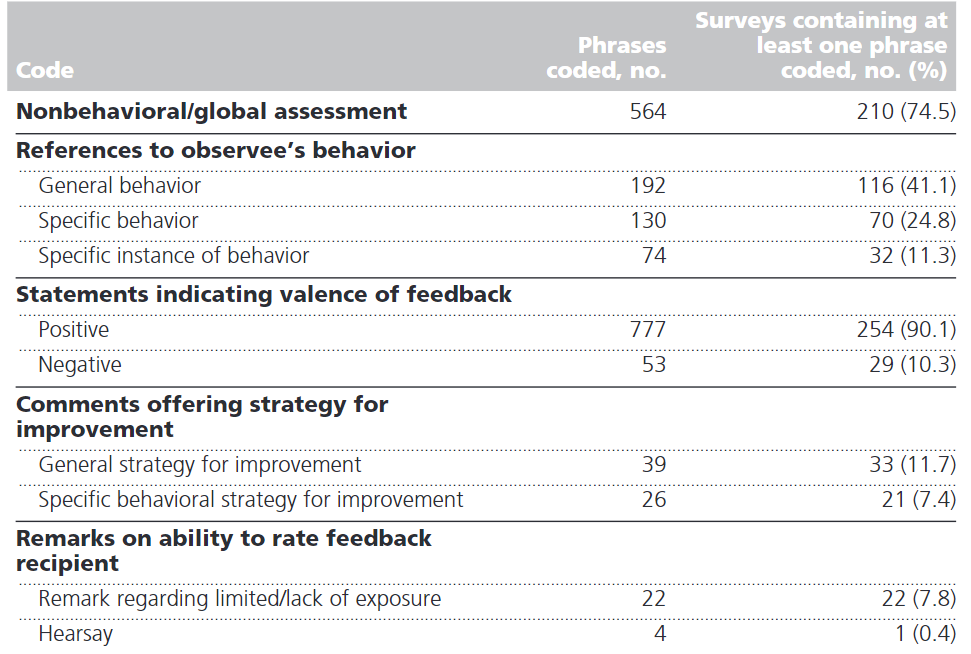

[@Canavan2010-zh]

## Faculty development

- Faculty development is important  but not sufficient
    - FD can tell
        - how feedback is given
    - FD cannot change
        - how feedback received by learner
        - feedback culture
    - also require learners’ receptivity to feedback
    - need to be accompanied by changes in the culture of feedback

[@Lefroy2015-vv]

## Effectiveness

### Factors related to feedback effectiveness

- reliability of evaluators
- timelessness of feedback
- individualized feedback

[@Watling2008-om]

- credibility of the feedback provider [@van-de-Ridder2014-ld]

### written feedback

- feedback was perceived as helpful in 3 studies
    - From narrative review
        - 8 Of the 8 studies involving peer feedback
    - outcome improvement in 1 study
        - Outcome improvements included
            - clinical exam scores
            - improved quality of notes
            - improvement in writing competency

[@Hansen2024-fe]

### Effective way may vary between individuals

- gender differences in the didactic condition only
    - with males giving lower ratings for utility of the training
    - feedback on learning and transfer of intercultural communication skills learned in an experiential training task

[@Kennedy2017-qf]

### Comments reliably reflect performance of residents

- comments are reliably reflect performance of residents
    - compare ITER score(18 items 1 to 5 likert scale) with free comment
    - free comment were converted to categories(A,B,C,D) by trained research assistant
        - Residents wer categorized into
            - A = outstanding, excellent, exemplary
            - B = solid,safe, may need some fine tuning
            - C = borderline, bare minimum, remediable
            - D = unsafe, unacceptable, multiple deficits
    - reliability coefficients averaged across four rankers were G = 0.85 and G = 0.91
    - For a single ranker, G = 0.60 and G = 0.73. Using  only the first three assessments
    - Using written comments to discriminate  between residents can be extremely reliable even after only several reports are  collected

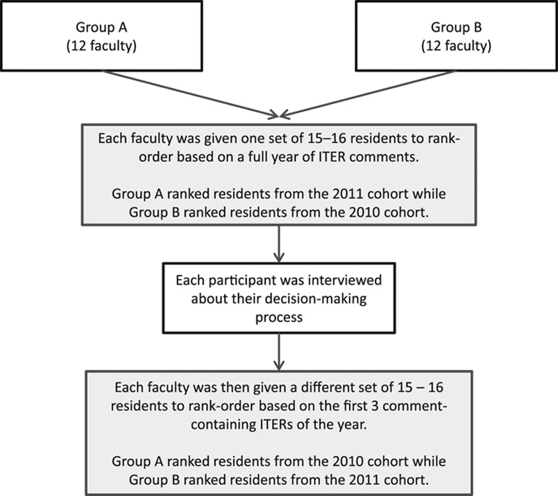
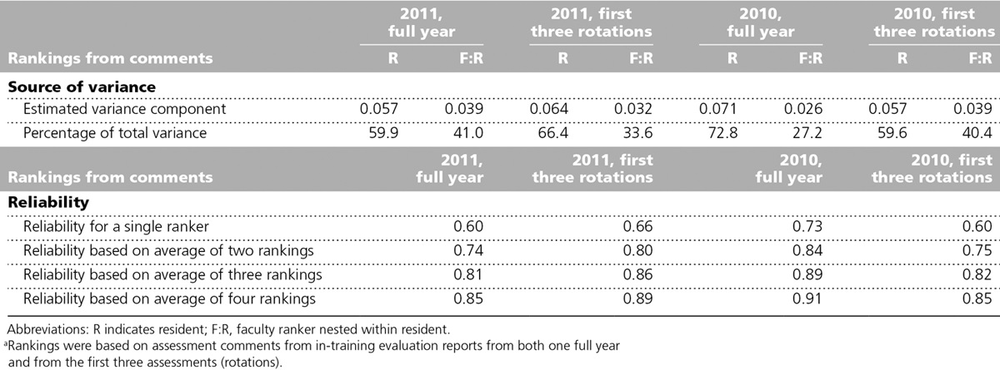

[@Ginsburg2017-ru]

#### Read between the lines to predict resident performance

- 24 faculty categorized a subgroup of residents based solely on comments for their clinical performance
- They were then interviewed to determine how they had made their judgement
- Residents wer categorized into
    - A = outstanding, excellent, exemplary
    - B = solid,safe, may need some fine tuning
    - C = borderline, bare minimum, remediable
    - D = unsafe, unacceptable, multiple deficits
- Participants made inferences based on what they thought evaluators intended by their comments and seemed to share an understanding of a ‘hidden code’
- Participants’ ability to ‘read between the lines’ explains how comments can be effectively used to categories and rank-order residents.

[@Ginsburg2015-yw]

## Role of technology-enhanced approaches

- Facilitating timely and convenient sharing of comments
- Students generally value
    - personalized and engaging nature of audio feedback
- Recent developments in learning analytics enable
    - information based on learning logs
    - digital traces to provide timely personalized feedback at scale

[@Hattie2007-kx]

### Evaluate Feedback using AI

#### Feedback comment quality and relevance to CanMed roles

- 2,349 written feedback comments from healthcare students’ ePortfolios
    - five healthcare educational programs:
        - specialistic medicine (postgraduate), general practice (postgraduate), midwifery (undergraduate), speech therapy (undergraduate) and occupational therapy (undergraduate).
- Manual labeling by human
    - feedback quality, and CanMed roles
- Fine-tuned BERT using labeled data
- Compare the performance of BERT with human
    - Calculate the F1 score
- Result

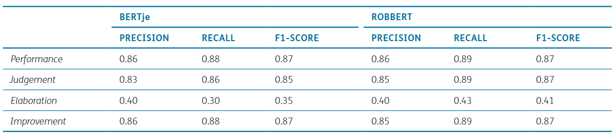

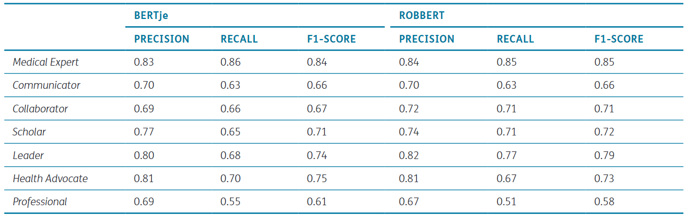

[@Van_Ostaeyen2023-ut]

### Feedback using AI

#### Effectiveness of AI-generated feedback

##### Prompts and feedback quality

- developed a theory-driven prompt manual

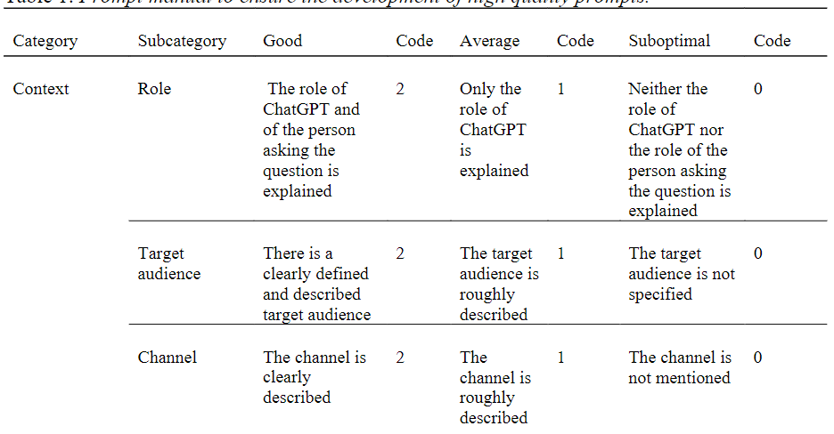
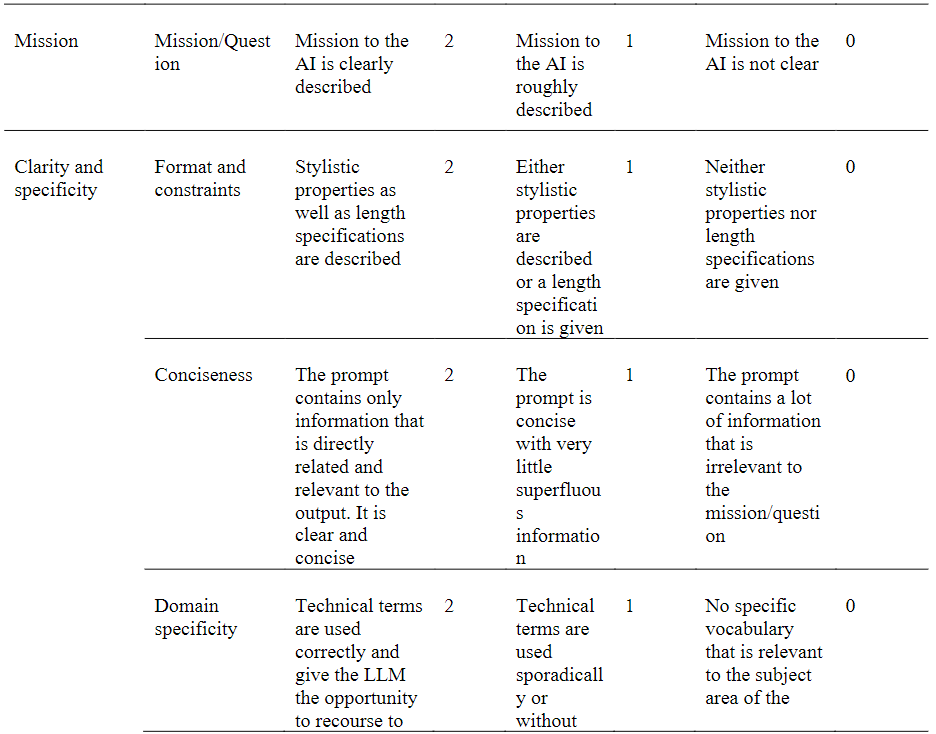
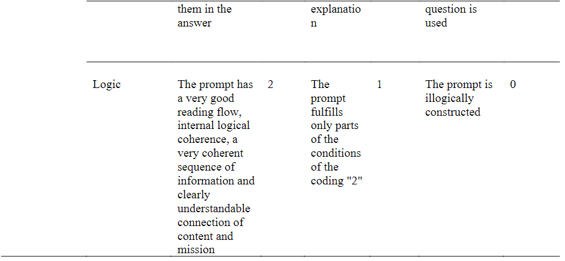

[@Jacobsen2023-jl]

##### In chinese to english translation

- revision of Chinese to English translation based on feedback below
    - AI-generated feedback(ChatGPT4)
    - teacher feedback(TF)
    - self-feedback(SF)
- TF-and SF-guided translation texts surpassed those with ChatGPT-based feedback
    - linguistic features: ChatGPT was superior to TF and SF
    - syntax-related skills: ChatGPT was inferior to TF and SF

[@Cao2023-xn]

##### on secondary student essays

- compared the quality of human  and AI(ChatGPT(v.3.5)) feedback
- five measures
    - (a) was criteria-based,
    - (b) provided clear directions for improvement
    - (c) was accurate
    - (d) prioritized essential features
    - (e) used a supportive tone
- human raters were better at providing high-quality feedback to students in all categories other than criteria-based

#### LLMs in English writing class

- Writing assignments of English as a second language (ESL) students
- RCT: LLM-generated feedback vs no feedback
- Groups
    - LLM-generated feedback
        - revised their text according to the feedback by ChatGPT3.5-turbo
    - Control group
        - revised their text without feedback
- Result
    - LLM-generated feedback group
        - increased revision performance (d=.19)
        - task motivation (d=.36)
        - positive emotions (d=.34)

[@Meyer2023-sp]

#### Feedback to peer teachers

- participants
    - parciticipants of in-service teacher professional development course
    -

[@Hunt2021-ng]

#### In programming assignments

- explorer the design of feedback for programming assignments

[@Hao2022-mt]

#### Robotic surgery

- analyzing video recorded robotic colorectal surgery
- compare with the scores by the expert surgeons (using global evaluative assessment of robotic skills (GEARS))
- positive correlation between human expert ratings of technical  efficiency and AI-determined total tool movement (r = − 0.72)

[@Yang2023-uc]

#### second language Writing

- automated written corrective feedback
- Using Notion AI
- an help improve self-regulation
    - through recording the whole writing process
    - AI allows learners to receive immediate, self-tailored, comprehensive AWCF
        - promote language-related noticing

[@Osawa2023-tc]

### Risks related to technology-enhanced approaches

- the process may still be dominated by feedback as telling
    - may inhibit students responsibility
- not ensue unless there are designs for student uptake
    - learner agency may be lacking

[@Carless2018-ul]

- eventually  replace  certain  roles  of  human  educators
    - quantity and quality of human
interactions and a decrease in the amount of personal attention and  feedback  students  receive

[@Lee2023-qp]

- Ethical concern
    - responsibility
    - AI system mistakes and errors
    - e.g., incorrect information  that  results  in  a  negative  outcome

[@Lee2023-qp]

## References
