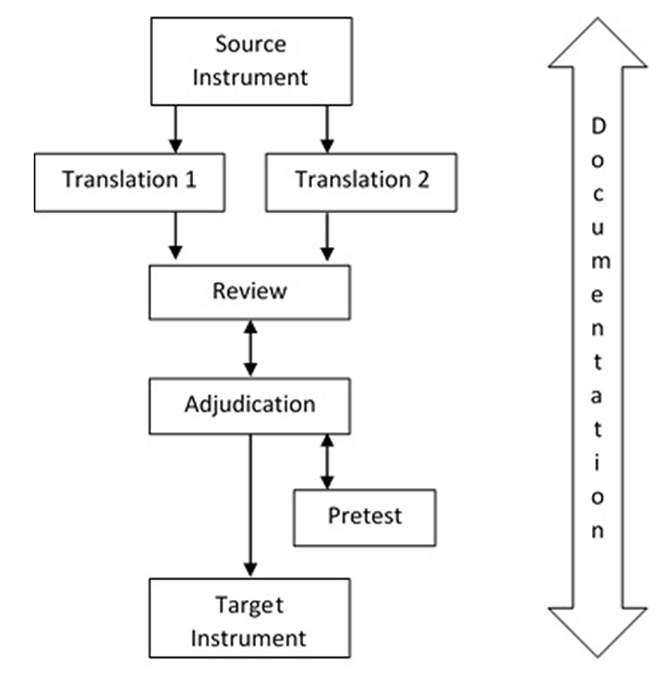
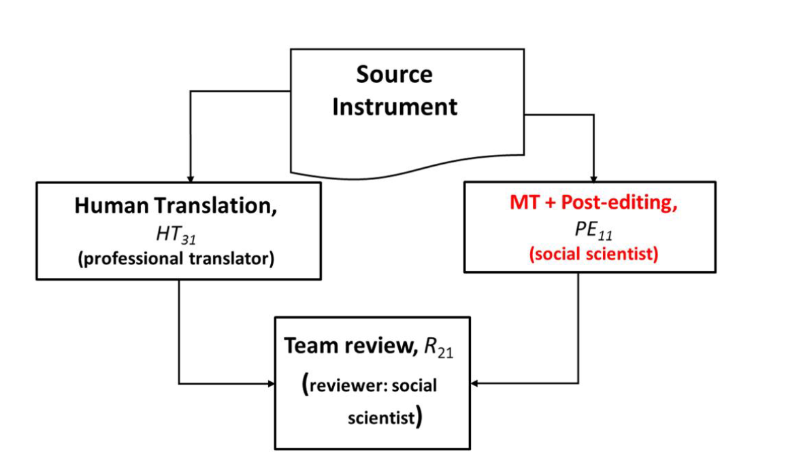

# Translation

## Problems in traditional translation

- Things to consider
  - linguistic characteristics
    - e.g., word order, sentence structure
  - cultural context
    - e.g., special connotations  of  single  words,  idioms
  - knowledge  about  the  population

cultural context is often overlooked

[@Walde2023-vi]

## TRAPD approach

- TRAPD
  - **T**ranslation
  - **R**eview
  - **A**djudication
  - **P**retest
  - **D**ocumentation

### Members

- translators: more than two
- reviewers: all translators and more than one
- adjudicators: more than one
- pretesters: a small group of target language speakers

### Steps

#### Translation

Two translators independently translate the original text into the target language.

#### Review

All translators and reviewers meet to discuss the translation and resolve any discrepancies.

#### Adjudication

Adjudicators resolve any discrepancies that remain after the review.

#### Pretest

The translated text is pretested with a small group of target language speakers to identify any issues.

[@Walde2023-vi]

### Variant

#### With machine translation

[@Zavala-Rojas2024-gf]

## Forward and back translation

- forward translation
  - translation of the original text into the target language
- back translation
  - translation of the target language text back into the original language to ensure that the meaning of the original text is preserved

[@Walde2023-vi]

## Translation in Care Measure

1. **Initial Translation**
   - The CARE Measure was initially translated from English into the target language by two bilingual translators, each working independently.
2. **Synthesis**
   - The two translations were then synthesized into a single version by a committee of experts.
3. **Back-Translation**
   - This synthesized version was back-translated into English by two different bilingual translators to check for consistency and accuracy.
4. **Expert Committee Review**
   - The back-translated version was reviewed by an expert committee, including the original authors, to resolve any discrepancies and ensure that the translated version retained the same meaning as the original.
5. **Pre-Testing**
   - The translated CARE Measure was pre-tested with a sample from the target population to identify and correct any issues related to comprehension or cultural relevance.
6. **Final Version**
   - Based on the pre-test feedback, the final version of the translated CARE Measure was produced.

[@Aomatsu2014-zl]

## References

::: {#refs}
:::
